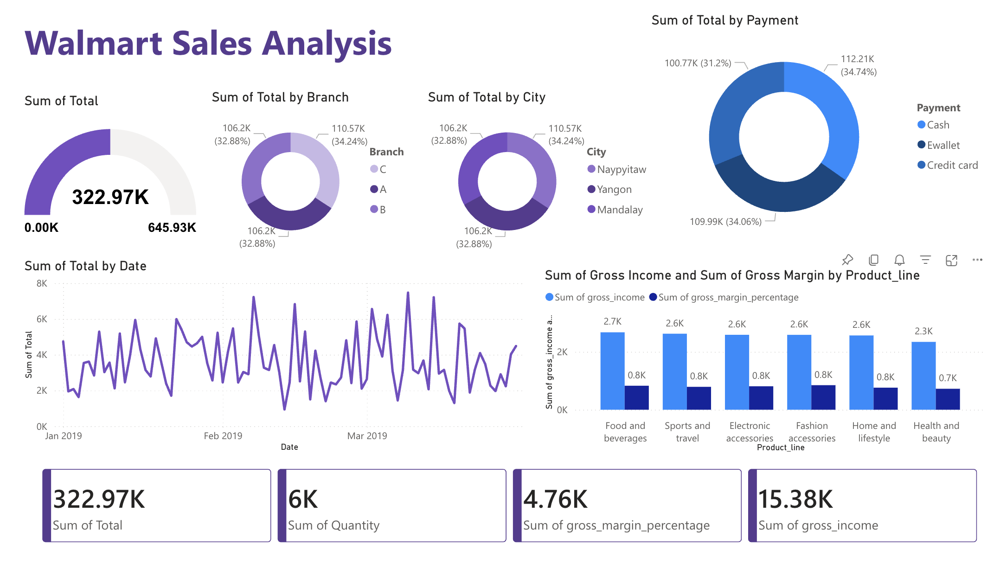

# Walmart Sales Analysis

A comprehensive sales data analysis project using **MySQL** for data exploration and **Power BI** for interactive visualizations — covering sales performance across branches, product lines, customer behavior, and revenue trends.

---

## Dashboard Preview



---

## Project Structure

```
walmart-sales-analysis/
│
├── dashboard/
│   └── dashboard.png               # Power BI dashboard screenshot
│
├── data/
│   └── WalmartSalesData.csv        # Raw sales dataset
│
├── script/
│   └── walmart_sales_sql_analysis.sql  # SQL queries for analysis
│
└── README.md
```

---

## Dataset

The dataset contains sales transactions from **3 Walmart branches** (A, B, C) located in **Naypyitaw, Yangon, and Mandalay**, spanning **January – March 2019**.

| Column | Description |
|---|---|
| `invoice_id` | Unique transaction ID |
| `branch` | Branch identifier (A, B, C) |
| `city` | City of the branch |
| `customer_type` | Member or Normal |
| `gender` | Customer gender |
| `product_line` | Product category |
| `unit_price` | Price per unit |
| `quantity` | Units sold |
| `tax_pct` | 5% tax on purchase |
| `total` | Total purchase amount |
| `date` | Transaction date |
| `time` | Transaction time |
| `payment` | Payment method |
| `cogs` | Cost of goods sold |
| `gross_margin_pct` | Gross margin percentage |
| `gross_income` | Gross income |
| `rating` | Customer satisfaction rating |

---

##  Feature Engineering

The following columns were derived from existing data:

- **`time_of_day`** — Morning, Afternoon, or Evening based on transaction time
- **`day_name`** — Day of the week (Mon–Sun)
- **`month_name`** — Month of the transaction (January, February, March)

---

##  Analysis Overview

### 🏪 Product Analysis
- Most selling product lines by quantity
- Total revenue by product line
- Product lines with highest VAT
- Good/Bad classification based on average sales
- Average customer ratings per product line

###  Sales Analysis
- Total revenue by month
- Largest COGS by month
- Revenue by city and branch
- Sales trends by time of day and day of week

###  Customer Analysis
- Customer type distribution (Member vs Normal)
- Gender breakdown per branch
- Customer ratings by time of day and day of week
- Tax contribution by customer type

---

##  Key Insights

- **Total Revenue:** 322.97K across all branches
- **Top Branch by Revenue:** Branch C (34.24% — 110.57K)
- **Most Used Payment Method:** Credit Card (34.74%)
- **Top Product Line by Gross Income:** Food and Beverages (2.7K)
- **Total Quantity Sold:** 6,000 units
- **Total Gross Income:** 15.38K

---

##  Tools Used

| Tool | Purpose |
|---|---|
| **MySQL** | Data storage, feature engineering, and exploratory analysis |
| **Power BI Service** | Interactive dashboard and visualizations |
| **CSV / Excel** | Raw data source |

---

## Getting Started

### Run the SQL Analysis

1. Create a MySQL database:
   ```sql
   CREATE DATABASE WalmartSales;
   USE WalmartSales;
   ```

2. Import the dataset from `data/WalmartSalesData.csv` into the `sales` table using MySQL Workbench or your preferred client.

3. Run `walmart_sales_sql_analysis.sql` to perform feature engineering and analysis queries.

---

##  Contact

Feel free to reach out or connect if you have any questions or feedback!